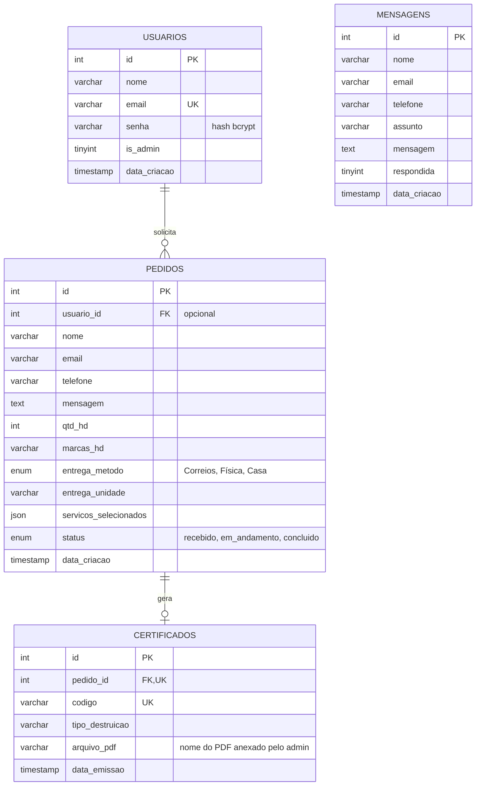
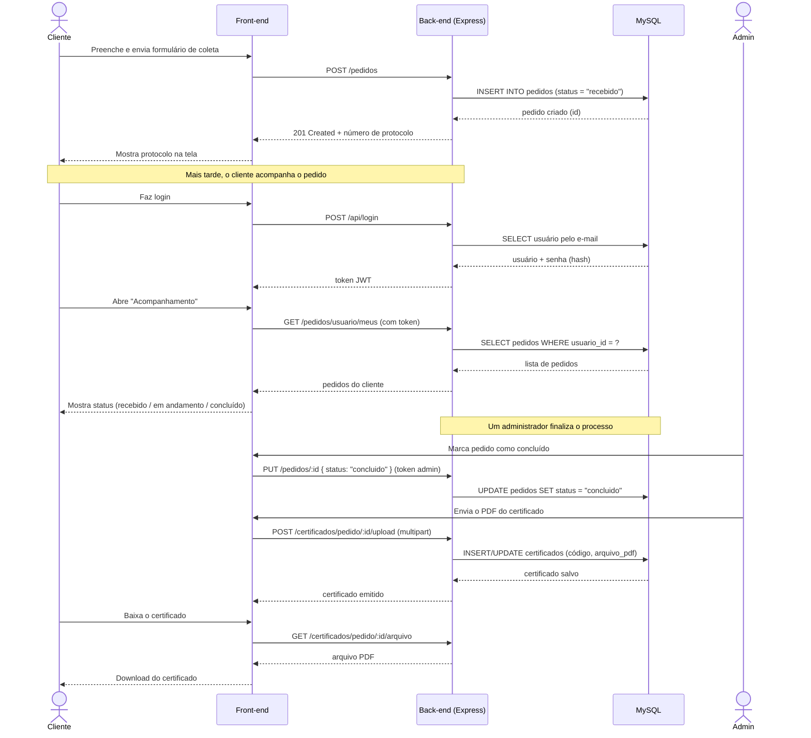

# Desintegre Digital

Sistema web completo para gestão de coleta, destruição segura de dados e emissão de certificados — desenvolvido como Projeto Integrador (Grupo 2 — Desintegre Digital).

A empresa recolhe dispositivos de armazenamento (HDs, SSDs, pendrives) de clientes, aplica um dos métodos de destruição (Trituração e Fragmentação, Overwriting ou Desmagnetização), e emite um certificado digital comprovando que os dados foram destruídos de forma irreversível.

## Descrição do sistema

O site permite que qualquer visitante:
- Conheça os serviços e métodos de destruição oferecidos;
- Crie uma conta ou faça login;
- Envie uma solicitação de coleta pelo formulário, escolhendo o(s) serviço(s) desejado(s);
- Envie mensagens pela página de contato;
- Acompanhe o andamento dos próprios pedidos (uma vez logado);
- Baixe o certificado de destruição em PDF quando o pedido for concluído.

Administradores (login fixo `admin` / `admin`) têm acesso a um painel para:
- Listar todos os pedidos e mensagens recebidas;
- Atualizar o status de um pedido (`recebido` → `em_andamento` → `concluido`);
- Anexar o PDF oficial do certificado a um pedido concluído.

## Tecnologias utilizadas

**Front-end**
- HTML5, CSS3 e JavaScript puro (sem framework)
- [jsPDF](https://github.com/parallax/jsPDF) (geração de certificado em PDF no navegador)

**Back-end**
- Node.js + Express
- MySQL (via `mysql2`)
- `bcryptjs` — hash de senha
- `jsonwebtoken` (JWT) — autenticação
- `multer` — upload de arquivos (PDF do certificado)
- `dotenv` — variáveis de ambiente
- `cors`

**Infraestrutura**
- **GitHub** — versionamento (Git) e repositório remoto
- **GitHub Pages** — hospedagem do front-end
- **Railway** — hospedagem do back-end + banco de dados MySQL, com deploy automático (CI/CD) a cada `git push`

## Estrutura do projeto

```
Desintegre-digital/
├── index.html                 -> redireciona para Front-end/html/inicial.html (necessário para o GitHub Pages)
│
├── Back-end/
│   ├── classes/                -> regras de negócio (orientação a objetos)
│   │   ├── Usuario.js
│   │   ├── Mensagem.js
│   │   ├── Pedido.js
│   │   └── Certificado.js
│   ├── routes/                 -> rotas da API (Express Router)
│   │   ├── authRoutes.js
│   │   ├── mensagensRoutes.js
│   │   ├── pedidosRoutes.js
│   │   └── certificadosRoutes.js
│   ├── middlewares/
│   │   └── autenticar.js       -> valida o token JWT e verifica permissão de admin
│   ├── js/
│   │   ├── db.js                -> conexão (pool) com o MySQL
│   │   ├── server.js            -> ponto de entrada do servidor
│   │   └── uploadCertificado.js -> configuração do multer (upload de PDF)
│   ├── sql/
│   │   └── desintegre.sql       -> script de criação do banco
│   ├── uploads/certificados/    -> PDFs de certificado enviados pelo admin
│   └── .env                     -> variáveis de ambiente (não versionado)
│
└── Front-end/
    ├── html/
    │   ├── inicial.html
    │   ├── sobre.html
    │   ├── servicos.html
    │   ├── trituracao.html      -> detalhes do método de Trituração e Fragmentação
    │   ├── overwriting.html     -> detalhes do método de Overwriting
    │   ├── desmagnetizacao.html -> detalhes do método de Desmagnetização
    │   ├── contatos.html
    │   ├── formulario.html      -> solicitação de coleta
    │   ├── acompanhamento.html  -> acompanhamento dos pedidos do usuário logado
    │   └── admin.html           -> painel administrativo
    ├── css/
    ├── js/
    ├── icon/
    └── img/
```

## Diagrama Entidade-Relacionamento (DER)



> A tabela `mensagens` (formulário de contato) é independente das demais — não tem relacionamento com `usuarios` ou `pedidos`.

## Diagrama de Sequência — fluxo completo de um pedido



## Endpoints da API

### Autenticação — `/api`
| Método | Rota | Descrição | Autenticação |
|---|---|---|---|
| POST | `/api/cadastro` | Cria uma nova conta | Nenhuma |
| POST | `/api/login` | Autentica (login normal ou admin fixo `admin`/`admin`) | Nenhuma |

### Mensagens de contato — `/contatos`
| Método | Rota | Descrição | Autenticação |
|---|---|---|---|
| POST | `/contatos` | Envia uma mensagem (formulário de contato) | Nenhuma |
| GET | `/contatos` | Lista todas as mensagens | — |
| GET | `/contatos/:id` | Busca uma mensagem | — |
| PUT | `/contatos/:id` | Marca como respondida | — |
| DELETE | `/contatos/:id` | Exclui uma mensagem | — |

### Pedidos — `/pedidos`
| Método | Rota | Descrição | Autenticação |
|---|---|---|---|
| POST | `/pedidos` | Cria uma solicitação de coleta | Opcional (vincula ao usuário se estiver logado) |
| GET | `/pedidos/usuario/meus` | Lista os pedidos do usuário logado | Obrigatória |
| GET | `/pedidos` | Lista todos os pedidos | Obrigatória + admin |
| GET | `/pedidos/:id` | Busca um pedido pelo id | Nenhuma |
| PUT | `/pedidos/:id` | Atualiza o status do pedido | Obrigatória + admin |
| DELETE | `/pedidos/:id` | Exclui um pedido | Obrigatória + admin |

### Certificados — `/certificados`
| Método | Rota | Descrição | Autenticação |
|---|---|---|---|
| POST | `/certificados/pedido/:pedidoId` | Emite o certificado (só se o pedido estiver `concluido`) | — |
| GET | `/certificados/pedido/:pedidoId` | Busca o certificado de um pedido | — |
| POST | `/certificados/pedido/:pedidoId/upload` | Admin anexa o PDF oficial do certificado | Obrigatória + admin |
| GET | `/certificados/pedido/:pedidoId/arquivo` | Baixa o PDF do certificado | Nenhuma |
| GET | `/certificados/verificar/:codigo` | Consulta pública de autenticidade pelo código | Nenhuma |
| GET | `/certificados` | Lista todos os certificados | Obrigatória + admin |

## Tutorial de instalação (ambiente local)

### Pré-requisitos
- [Node.js](https://nodejs.org) (LTS)
- MySQL (ex: via [WampServer](https://www.wampserver.com/))

### Passo a passo

1. Clone o repositório:
```bash
   git clone https://github.com/NOMAD-ass/Desintegre-digital.git
   cd Desintegre-digital
```

2. Crie o banco de dados rodando o script `Back-end/sql/desintegre.sql` no seu MySQL (phpMyAdmin, MySQL Workbench, DBeaver, etc.).

3. Configure as variáveis de ambiente:
```bash
   cd Back-end
```
   Crie um arquivo `.env` nessa pasta com:
```
   DB_HOST=localhost
   DB_PORT=3306
   DB_USER=root
   DB_PASSWORD=
   DB_NAME=desintegre_digital
   JWT_SECRET=uma-chave-aleatoria-qualquer
   PORT=3000
```

4. Instale as dependências e rode o servidor:
```bash
   npm install
   npm start
```
   Deve aparecer: `Servidor online em http://localhost:3000`

5. Abra `Front-end/html/inicial.html` diretamente no navegador (ou use a extensão Live Server do VSCode).

## Tutorial de deploy

### Back-end (Railway)
1. Crie uma conta em [railway.app](https://railway.app) com login do GitHub.
2. **New Project → Deploy from GitHub repo** e selecione este repositório.
3. Em **Settings → Root Directory**, defina `Back-end`.
4. Adicione um banco: **+ New → Database → MySQL**.
5. No serviço do back-end, em **Variables**, adicione:
```
   DB_HOST=${{MySQL.MYSQLHOST}}
   DB_PORT=${{MySQL.MYSQLPORT}}
   DB_USER=${{MySQL.MYSQLUSER}}
   DB_PASSWORD=${{MySQL.MYSQLPASSWORD}}
   DB_NAME=${{MySQL.MYSQLDATABASE}}
   JWT_SECRET=uma-chave-aleatoria-diferente-da-local
```
6. Rode o script `Back-end/sql/desintegre.sql` no banco do Railway (Console do MySQL ou um client como o Database Client do VSCode).
7. Em **Settings → Networking → Generate Domain**, gere o domínio público da API.
8. Cada `git push` na branch `main` faz o redeploy automático (CI/CD).

### Front-end (GitHub Pages)
1. No repositório do GitHub, vá em **Settings → Pages**.
2. Em **Source**, escolha **Deploy from a branch** → branch `main` → pasta `/ (root)` → **Save**.
3. O `index.html` na raiz do repositório redireciona automaticamente para `Front-end/html/inicial.html`.
4. O site fica disponível em `https://<usuario>.github.io/Desintegre-digital/` e também é atualizado a cada `git push`.

> Depois do deploy, é preciso apontar as chamadas `fetch` do front-end (arquivos `js/inicial.js`, `js/formulario.js`, `js/contatos.js`, `js/acompanhamento.js`) para a URL pública do back-end no Railway em vez de `http://localhost:3000`.